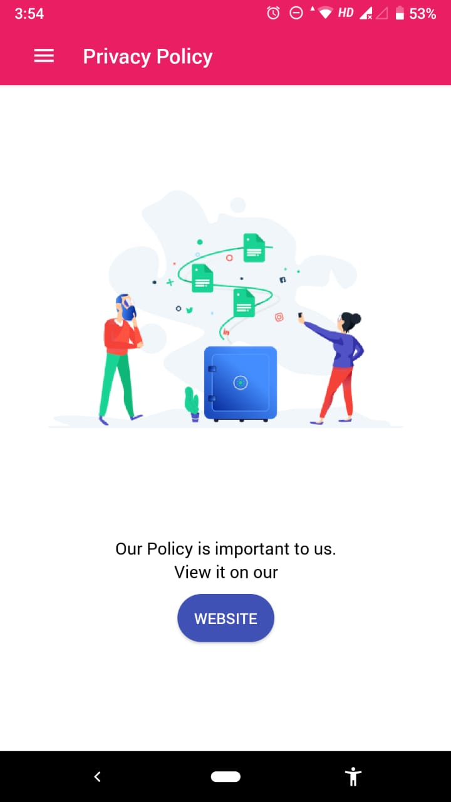

# ReactNative-NDA-InternshipTask
These screenshorts belong to an android application I developed for a startup company (NDA) 

3rd party libraries used : Native-base, react-navigation,react-native-linear-gradient, axios, firebase, react-native-fbsdk etc

#Home page - After Authentication

#AboutUs page - After Authentication

#Calorie Adder Full Screen Modal with android backbutton customized to close modal

#Fb Auth 

#Privacy Policy Page

#Signup Page

#Drawer

